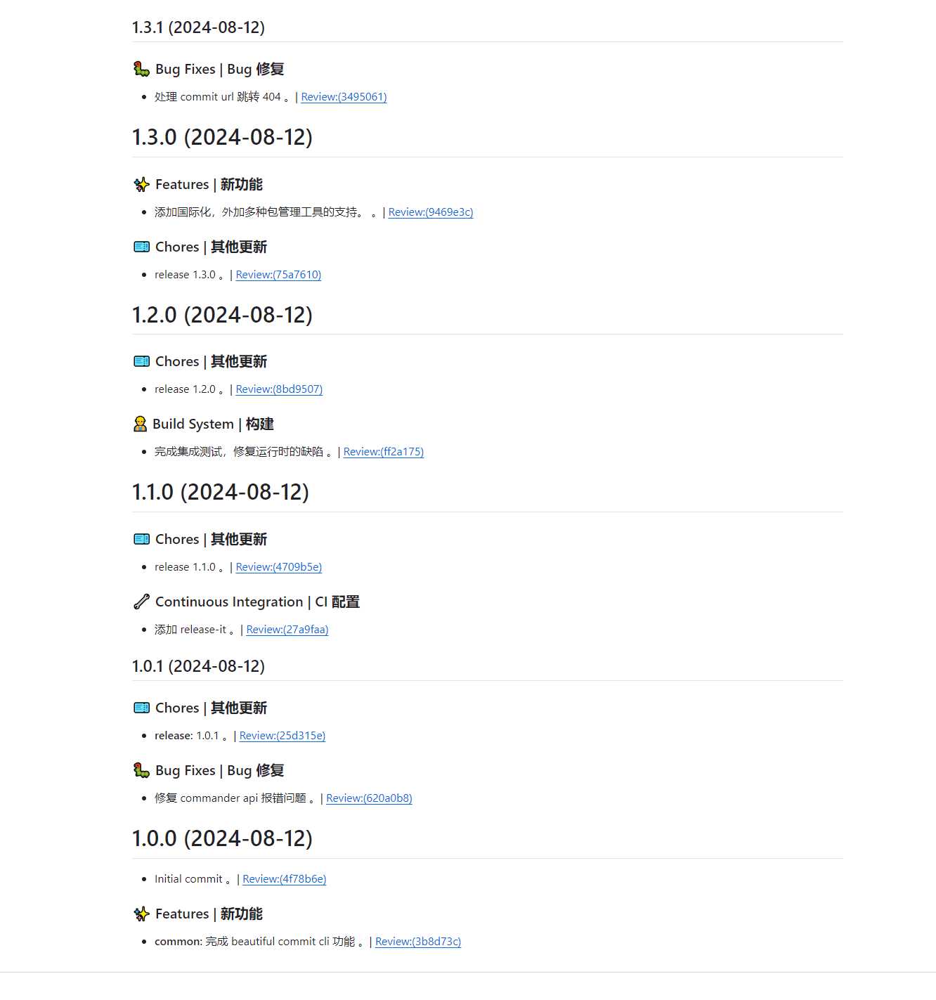

# beautiful-commit-cli

写一个给项目添加美丽的commit的脚手架工具，让项目的 提交 和 变更日志 更加舒服。\
Create a cli tool to add beautiful commits to a project, making the commit and change log more comfortable.


## Scaffold use

```
# 全局安装该脚手架
npm install -g beautiful-commit-cli

# --lang zh_CN.UTF-8 表示中文，如果不传则默认为英文
beautiful --project-path /path/to/your/project --lang zh_CN.UTF-8
```


## Feature use




[CHANGELOG.md](./CHANGELOG.md)

## reference

[aiyoudiao.github.io/gitmoji-zh](https://aiyoudiao.github.io/gitmoji-zh/)

https://www.conventionalcommits.org/zh-hans/v1.0.0/

https://cz-git.qbb.sh/zh/guide/introduction


## issus

https://github.com/aiyoudiao/beautiful-commit-cli/issues
